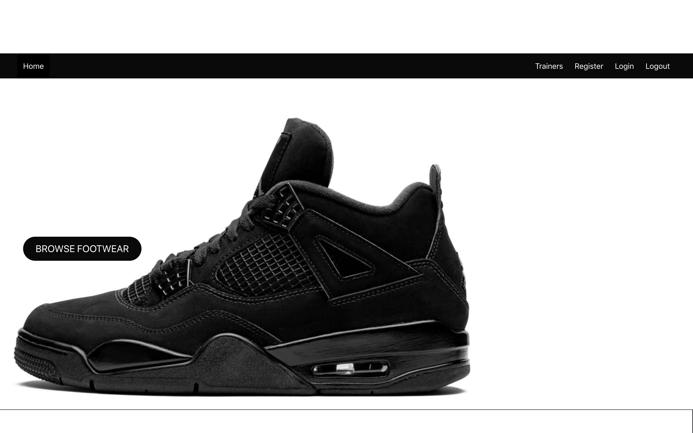
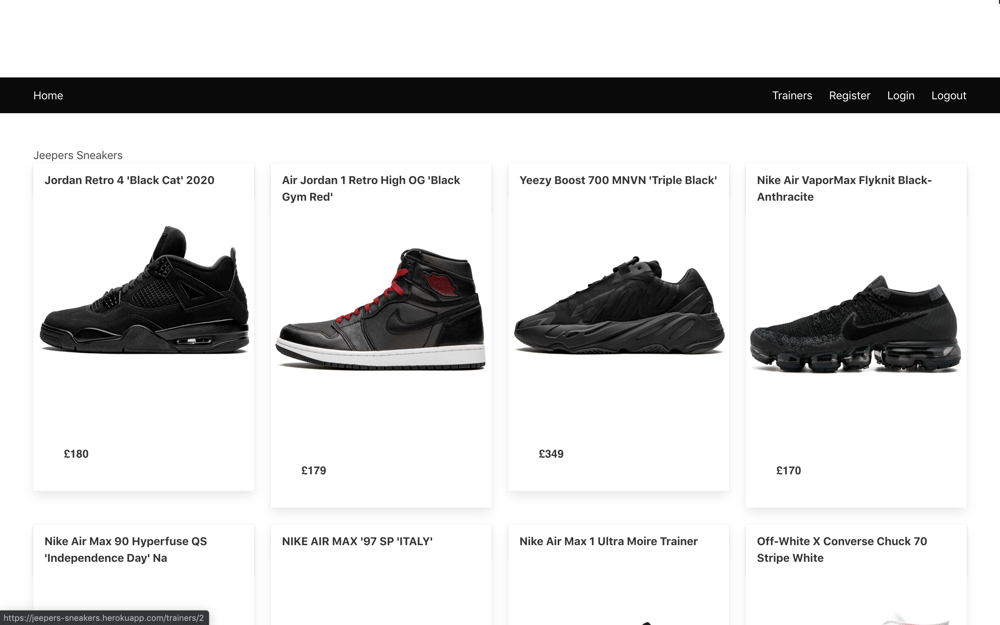
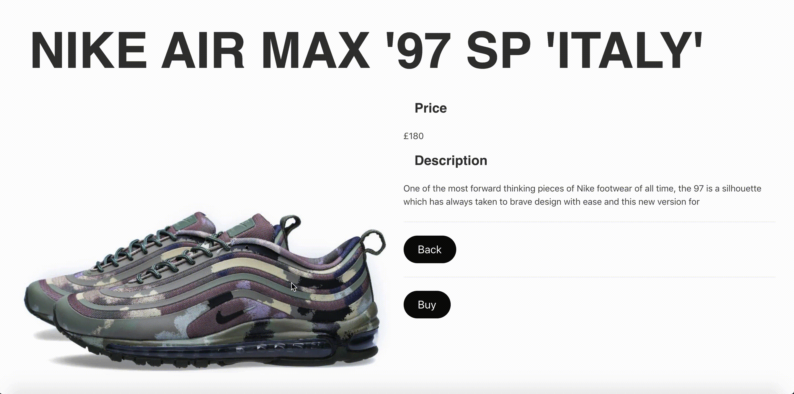

# Software Engineering Immersive: Project 4
This was the fourth and last project I built whilst studying the Software Engineering Immersive course at General Assembly.

I had a 1 week deadline to build this application

# Jeeper Sneakers

Jeepers sneaker is a e-commerce site selling trainers. this was project I always wanted to make as i'm into trainers and also really into the e-commerce side of 

## Brief
The projects necessary requirements were..
* Choose to work solo or in a team
* **Build a full-stack application** by making your own backend and your own front-end
* **Use a Python Django API** using Django REST Framework to serve your data from a Postgres database
* **Consume your API with a separate front-end** built with React
* **Be a complete product** which most likely means multiple relationships and CRUD functionality for at least a couple of models
* **Implement thoughtful user stories/wireframes** that are significant enough to help you know which features are core MVP and which you can cut
* **Have a visually impressive design** to kick your portfolio up a notch and have something to wow future clients & employers. 
* **Be deployed online** so it's publicly accessible.


## Tech Stack
+ HTML5
+ SCSS & Bulma
+ Javascript
  * ECMAScript6
  * React.js
  * axios
+ Python
  * Django
+ PostgreSQL
+ Testing
  * Manual: Insomnia
  * Table Plus
+ Git & GitHub
+ Heroku

## Release History
1.0 - Date of submission and deployment (04/03/20).

## Deployment
This application is deployed on Heroku and it can be found here - [Jeepers Sneakers](https://jeepers-sneakers.herokuapp.com/)

### Back-end Development
**Models**
The backend was served by a PostgreSQL database. I used Table Plus to interact with data and check everything was being stored correctly. We created one table, which contained (JWT_Auth).

The Trainer model was quite simple as I planned on adding more functionality to it later.

 **one-to-many** relationships as a user can apply one like to each trainer they liked.
```py
class Trainer(models.Model):
    name = models.CharField(max_length=50)
    price = models.CharField(max_length=5)
    image = models.CharField(max_length=300)
    description = models.CharField(max_length=300)

    def __str__(self):
        return f'{self.name}'

class Like(models.Model):
  like = models.IntegerField(default=0)
  owner = models.ForeignKey(User, related_name='likes', null=True, on_delete=models.CASCADE)
  trainer = models.ForeignKey(Trainer, related_name="likes", null=True, on_delete=models.CASCADE)
  def __str__(self):
    return f'Like by {self.owner} on {self.trainer}'

```

### Front-end Development

The front-end was created with React.js and used Axios to send requests to our back-end and perform the CRUD tasks within the database. Using React on the front-end on this project was really good as I am becoming more familiar with it. I was also able to use some reusable components that I could implement into this project.

To initialise the front-end I used Facebook's Create-React-App to get it up and running.

These are some features of the website that were designed using React.js. I decided to keep the aesthetic of the website clean and minimalist as most . 







The above gif is a react magnifier plugin I downloaded so that you can see the details of trainers that the user select

This was the code used to execute it 

```js
 <figure className="image">
                        <Magnifier img src={this.state.trainer.image} alt={this.state.trainer.name}  />
                      </figure>

```


### Challenges
The main challenges I faced when building this project were...

+ The main challenge I had when building this was I originally planned to build a checkout using the the react stripe api so that customers could select their checkout to buy the trainers that they selected. However, reading and understading the documents was taking too long and I spent abit too long on trying to implement it. which hindered the amount of time I could speand on building the login/register pages.


### Improvements
The improvements I would like to add to this project are the following...

+ Given more time, to create a user profile page, and also allow the customers to like trainers as I ran out of time to do so.
+ Improve the styling of the page.
+ Add a checkpout process to so users can complete the process.

